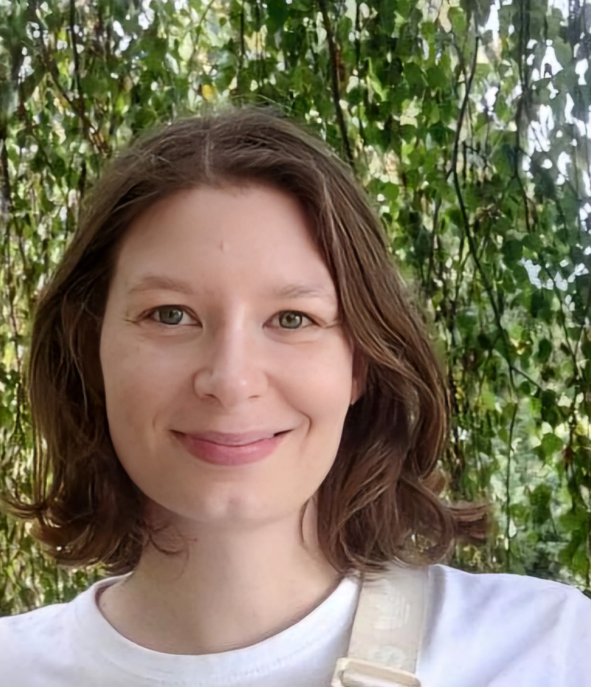

# Dr. Pia Schoknecht 

 
Postdoc in the Vasishth Lab 
Dept. of Linguistics 
University of Potsdam 
14476 Potsdam, Germany 
Email: schoknecht squiggle uni minus potsdam dot de 

<a itemprop="sameAs" content="https://orcid.org/0000-0003-0304-6787" href="https://orcid.org/0000-0003-0304-6787" target="orcid.widget" rel="me noopener noreferrer" style="vertical-align:top;">https://orcid.org/0000-0003-0304-6787</a>

 

## CV
Postdoctoral Researcher, Department of Linguistics, University of Potsdam, Germany,  2020 - ongoing 
Dr. phil: Psychological, Neurological and Clinical Linguistics, University of Salzburg, Austria, 2020 
MA Linguistics: Cognition and Communication, University of Marburg, Germany, 2014 
BA Language and Communication, University of Marburg, Germany, 2012 

## Publications

### Peer-reviewed
Schoknecht, P., Roehm, D., Schlesewsky, M. and Bornkessel-Schlesewsky, I. (2022): The interaction of predictive processing and similarity-based retrieval interference: an ERP study, Language, Cognition and Neuroscience, <a href="https://doi.org/10.1080/23273798.2022.2026421">https://doi.org/10.1080/23273798.2022.2026421</a> 

### In Preparation
Schoknecht, P., Roehm, D., Schlesewsky, M. and Bornkessel-Schlesewsky, I. (in prep.): *Internal model updating under interference: An ERP study across the lifespan*.

### Dissertation
Schoknecht, P. (2020): *The Interplay of Interference and Prediction during Language Comprehension*. (Doctoral dissertation).
