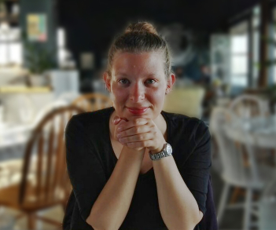

# Pia Schoknecht 

 
Postdoc in the Vasishth Lab 
Dept. of Linguistics 
University of Potsdam 
14476 Potsdam, Germany 
Email: schoknecht squiggle uni minus potsdam dot de 

 
 

## CV
Doctoral Programme: Psychological, Neurological and Clinical Linguistics, University of Salzburg, Austria, (pending)

MA Linguistics: Cognition and Communication, University of Marburg, Germany, 2014

BA Language and Communication, University of Marburg, Germany, 2012

 

## Publications

### Preprint
Schoknecht, P., Roehm, D., Schlesewsky, M. and Bornkessel-Schlesewsky, I. (2019): *Looking forward does not mean forgetting about the past: ERP evidence for the interplay of predictive coding and interference during language processing*. Preprint, https://doi.org/10.1101/567560.

### In Preparation
Schoknecht, P., Roehm, D., Schlesewsky, M. and Bornkessel-Schlesewsky, I. (in prep.): *Internal model updating under interference: An ERP study across the lifespan*.

### Dissertation
Schoknecht, P. (2020): *The Interplay of Interference and Prediction during Language Comprehension*. (Doctoral dissertation).
