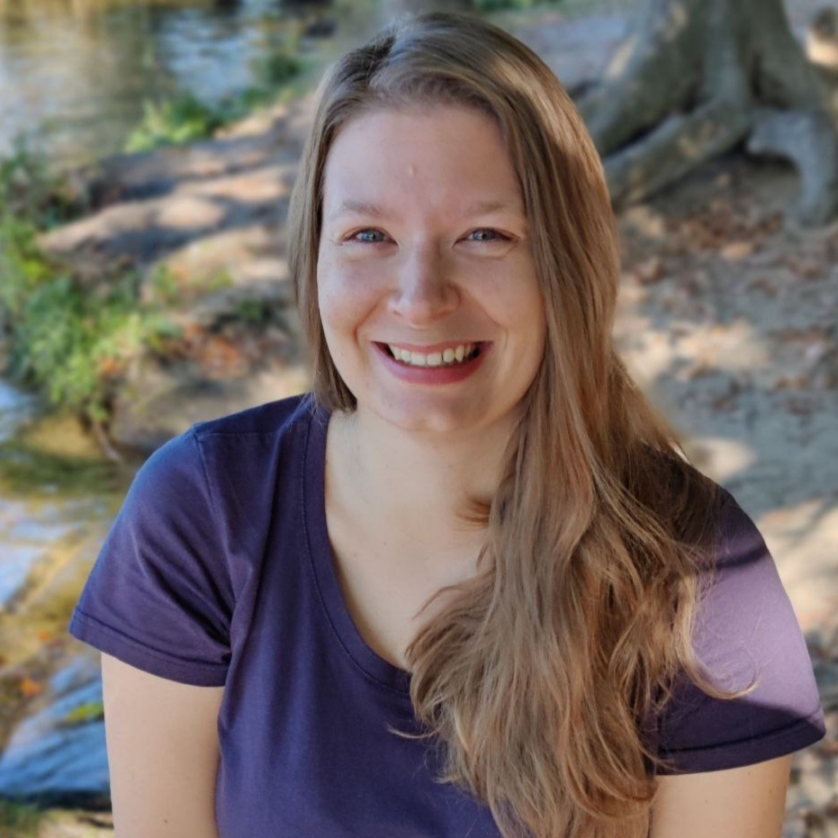

# Dr. Pia Schoknecht 

 

 
I work as a Postdoc in the Vasishth Lab at the University of Potsdam, Germany. I use behavioral and electrophysiological methods to investigate how we use our memory and prediction during language processing.  

 
 
Email: pia.schoknecht at uni minus potsdam dot de 
 

<a itemprop="sameAs" content="https://orcid.org/0000-0003-0304-6787" href="https://orcid.org/0000-0003-0304-6787" target="orcid.widget" rel="me noopener noreferrer" style="vertical-align:top;">https://orcid.org/0000-0003-0304-6787</a>

<a href="https://scholar.google.de/citations?hl=de&user=LPyeniYAAAAJ">Google Scholar</a>

 
 

## CV
* Postdoctoral Researcher, Department of Linguistics, University of Potsdam, Germany,  2020 - ongoing 
* Dr. phil: Psychological, Neurological and Clinical Linguistics, University of Salzburg, Austria, 2020 (Supervisors: Dietmar Roehm, Ina Bornkessel-Schlesewsky)   
* MA Linguistics: Cognition and Communication, University of Marburg, Germany, 2014 
* BA Language and Communication, University of Marburg, Germany, 2012 

## Publications

### Preprints
Schoknecht, P. and Vasishth, S. (2026). Local coherence effects are task sensitive: Evidence from event-related potentials in German. <a href="https://doi.org/10.31234/osf.io/3b27u_v1">https://doi.org/10.31234/osf.io/3b27u_v1

Schoknecht, P., Paape, D. and Vasishth, S. (2025). The time course of local coherence effects in German: Evidence from self-paced reading times and event-related potentials. <a href="https://doi.org/10.31219/osf.io/y8jf6_v3">https://doi.org/10.31219/osf.io/y8jf6_v3

### Peer-reviewed
Schoknecht, P., Yadav, H. and Vasishth, S. (2025). Do syntactic and semantic similarity lead to interference effects? Evidence from self-paced reading and event-related potentials using German. Journal of Memory and Language. 141. <a href="https://doi.org/10.1016/j.jml.2024.104599">https://doi.org/10.1016/j.jml.2024.104599</a> 

Schoknecht, P., Roehm, D., Schlesewsky, M. and Bornkessel-Schlesewsky, I. (2022): The interaction of predictive processing and similarity-based retrieval interference: an ERP study. Language, Cognition and Neuroscience, 37(7), 883-901. <a href="https://doi.org/10.1080/23273798.2022.2026421">https://doi.org/10.1080/23273798.2022.2026421</a> 

### Dissertation
Schoknecht, P. (2020): *The Interplay of Interference and Prediction during Language Comprehension*. (Doctoral dissertation).

